# 🌀 Avaliação de Nível

> Documentação necessário para a solução proposta da avaliação técnica da Mobit. 

## 📋 Descrição

Este projeto é desenvolvido em **Python 3.12** e utiliza o [`uv`](https://github.com/astral-sh/uv) como gerenciador de pacotes. O `uv` oferece desempenho superior e gerenciamento simplificado de dependências, substituindo ferramentas tradicionais como `pip`, `virtualenv` e `conda`.

## 🏗️ Estrutura de Diretórios

```
mobit_challenge/
├── data/            # Dados de entrada
├── models/          # Pesos treinados das redes
├── results/
    ├── parte_1 # output_image.png
    ├── parte_2 # predict/image0.jpg
    ├── parte_3 # Gráficos e métricas geradas dos modelos
├── src/             # dataset.py, train.py, eval.py, models.py, ...
├── utils/           # Funções utilitárias (metrics.py e data.py)
├── part_1.py        # Script parte 1
├── part_2.py        # Script parte 2
├── part_3.py        # Script parte 3
├──
├── requirements.txt
└── README.md
```


## 🧱 Estrutura da Avaliação

O projeto está dividido nas seguintes etapas:

### 🔹 Parte 1 – Processamento Digital de Imagens
Algoritmos de pré-processamento, transformações e análise de imagens.

### 🔹 Parte 2 – Contagem de Pessoas com YOLOv8
Uso do YOLOv8 para contagem de pessoas a partir da deteção.

### 🔹 Parte 3 – Classificador de Tipos de Carros
Aplicação prática de um modelo treinado para identificação e classificação de veículos a partir de imagens.

## 🛠️ Requisitos

- Python >= 3.11
- `uv` instalado globalmente
- CUDA Toolkit instalado (opcional, mas recomendado para para aceleração por GPU)
  - Versão do CUDA = 11.8

### Como instalar o `uv`

```bash
curl -Ls https://astral.sh/uv/install.sh | bash 
```

## ⚙️ Como rodar o projeto

```
uv venv
```

```
source .venv/bin/activate  # Linux/Mac
.venv\Scripts\activate     # Windows
```

```
uv pip install -r requirements.txt
```

Somente após instalar as dependências, instale separadamente o torch baseado na versao do seu CUDA
```
uv pip install torch torchvision torchaudio --index-url https://download.pytorch.org/whl/cu118
```

## ⚙️ Resultados e Discussões

### Parte 1
Técnicas usadas na pipeline de PDI

Pré-processamento: suavização usando "GaussianBlur"

Processamento: segmentação testando 3 abordagens diferentes, threshold fixo, threshold de otsu, threshold adaptativo gaussiano e, por fim, deteção de contornos usando o algoritmo canny.

Pós-processamento: suavização de contornos

Resultados comparativos:

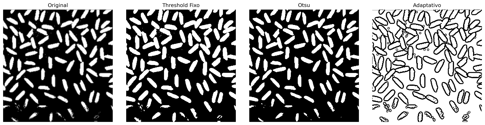

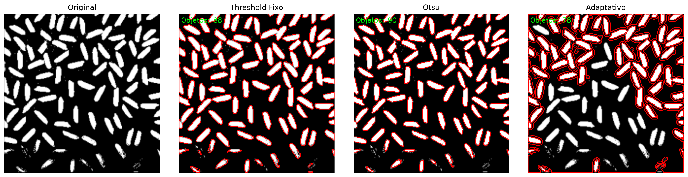

### Parte 2
Nessa etapa não houveram dificuldades vistas. O ponto crucial foi a escolha da variação do YOLOv8.

Pensamento inicial: iniciar pelo modelo pré-treinado mais leve, ou seja, o `yolov8n.pt`. Como já obtivemos o resultado desejado (número de pessoas na imagem) usando ele sem a necessidade de transfer-learning/fine-tuning, decidimos apenas complementar essa seção de resultados usando a versão seguinte (com mais parâmetros, mas ainda leve) para fins de maiores confiabilidades, pois observou-se que algumas pessoas, apesar de terem sidos detectadas, foram com baixas confiabilidades.

Resultados comparativos:

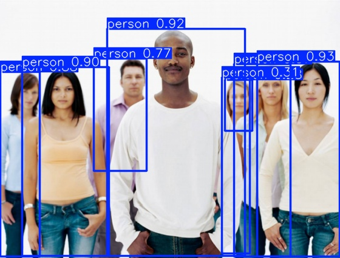

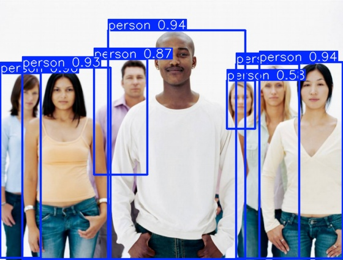

### Parte 3
Durante a solução desse problema foi notado que, após aglutinação das classes, apresentou-se um problema de desbalanceamento de classe e, portanto, precisavamos contornar isso de alguma maneira. Algumas abordagens adotadas que obtiveram resultados surpreendentes foram:

`Modificação na função de perda:`

Quando pensamos em tarefas de classificações simples/tradicionais, usamos a `CrossEntropyLoss `, no entanto, o uso dessa função não leva em consideração as classes minoritárias, logo tende a inviesar o modelo durante o treinamento, para tanto, decidimos usar a variante dessa função, a `CrossEntropyLoss` que usa pesos das classes para penalizar classes maioritárias.

Quando pensamos em tarefas de classificações simples/tradicionais, usa-se a `CrossEntropyLoss`, no entanto, isso pode fazer com que o modelo priorize as classes mais frequentes, ignorando as minoritárias, ajustando demais os modelos as classes maioritárias durante o treinamento, portanto decidi usar a versão ponderada da `CrossEntropyLoss`, __atribuindo pesos inversamente proporcionais à frequência de cada classe__. Pois, dessa forma, o erro nas classes minoritárias tem maior impacto no processo de aprendizagem, tornando o modelo menos enviesado e mais generalista.

`Data augmentation:`
Usamos um multiplicador de x8 em relação ao número de amostras das classes minoritárias para que fique relativamente igual o número de amostras de cada classe.
- Resize((img_size, img_size))
- RandomHorizontalFlip(p=0.5)
- RandomRotation(degrees=15)
- ColorJitter(brightness=0.2, contrast=0.2, saturation=0.2, hue=0.1)
- RandomAffine(degrees=0, translate=(0.1, 0.1))

`Transfer-learning (tl)` e `Fine-tuning (ft)`

Weight_Decay:
Adicionar uma penalização ao valor dos pesos da rede durante o treinamento para evitar o overfitting e melhorar na generalização das redes.

Resultados comparativos:
Para fins resumidos, iremos plotar somente os melhores resultados entre os métodos entre transfer-learning e fine-tuning (ambos os resultados estão no diretório de `results/parte_3`).

### ConNext_Tiny
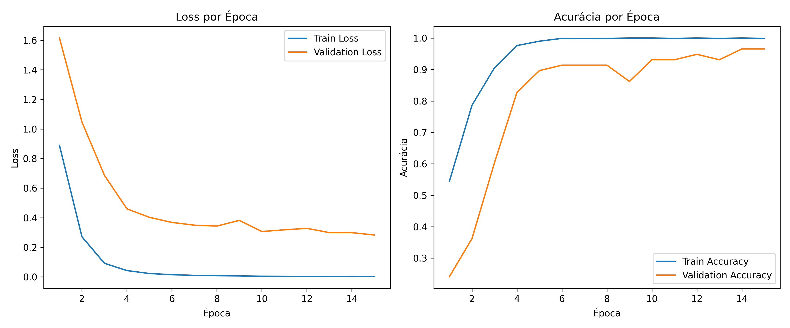

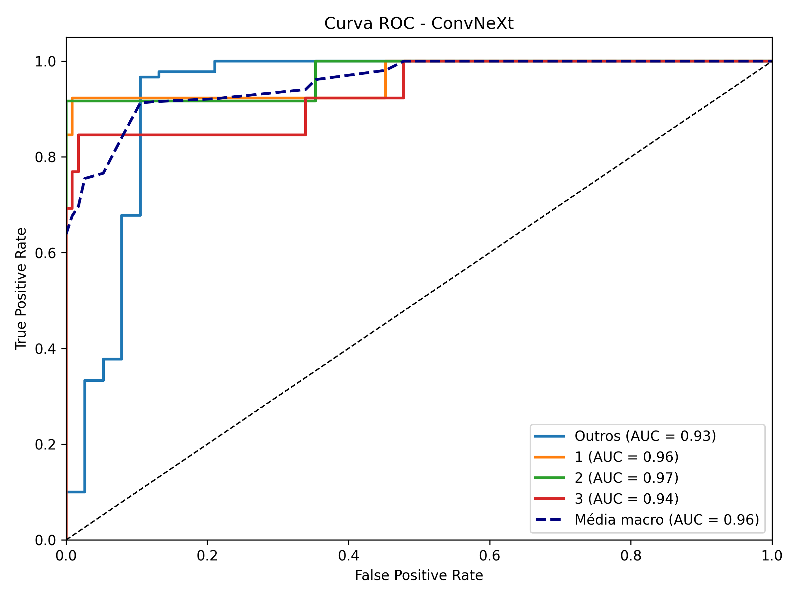

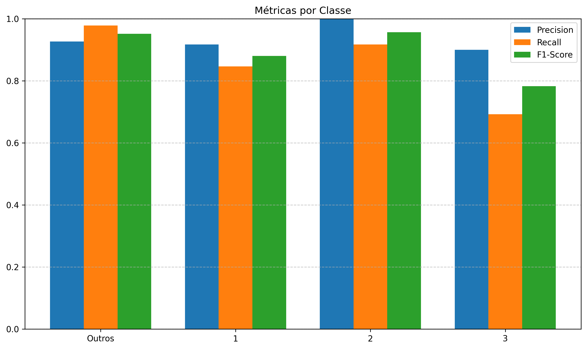

Na inferência:
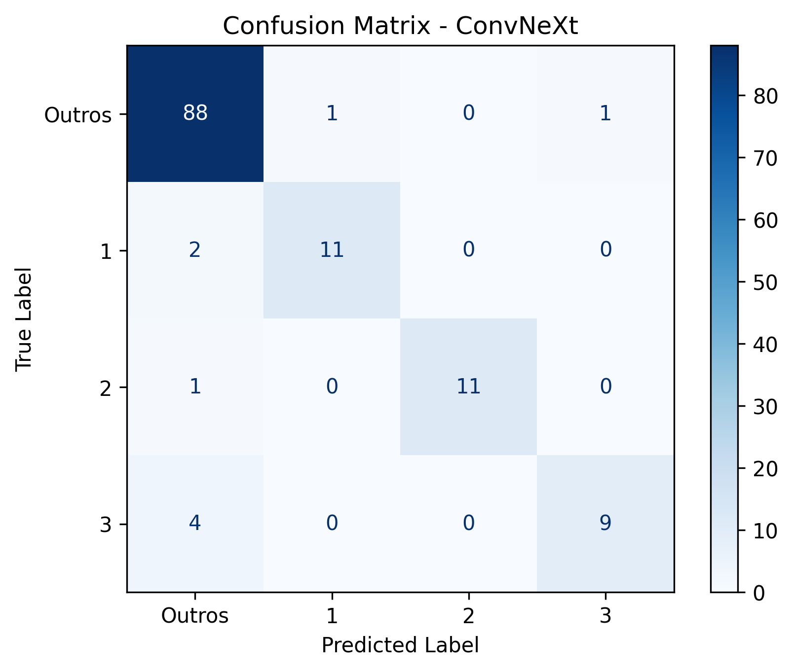

### EfficientNetV2s
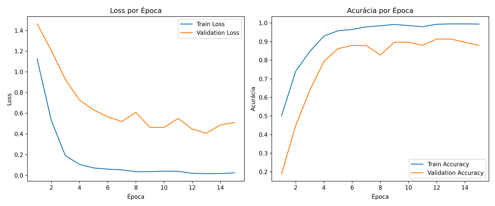

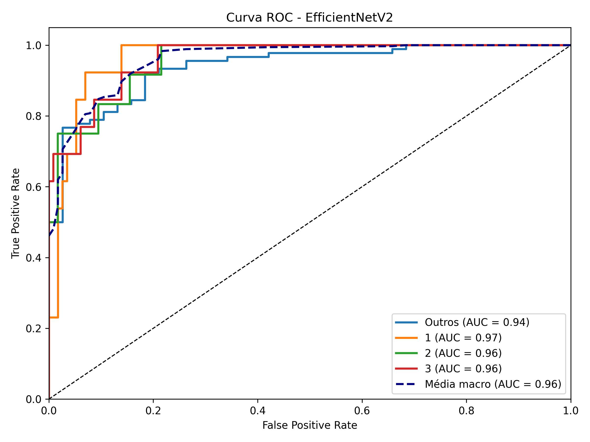

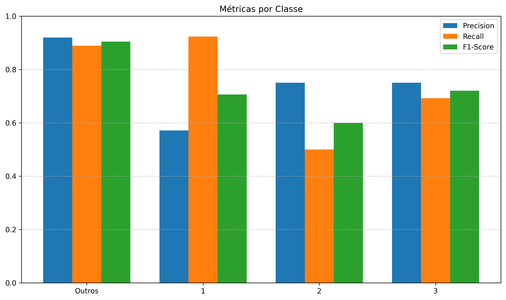

Na inferência:


### ResNet50
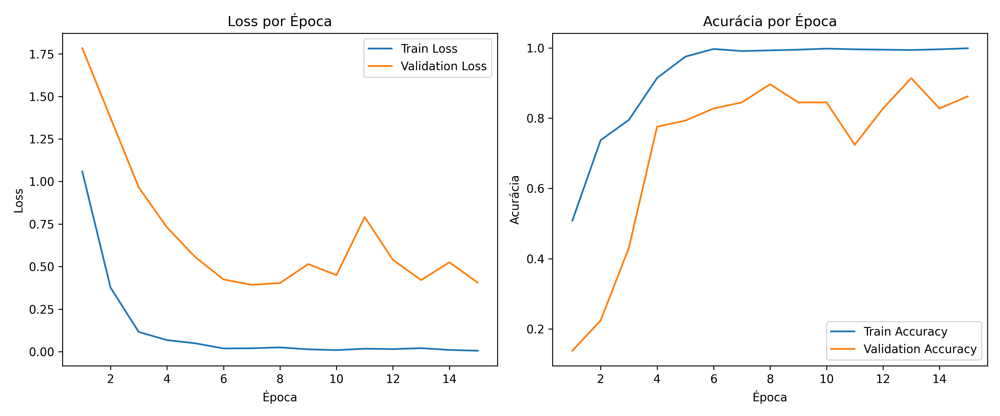

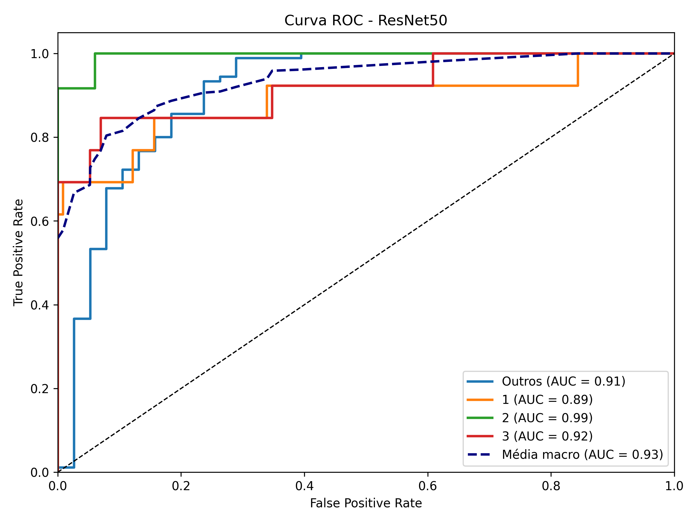

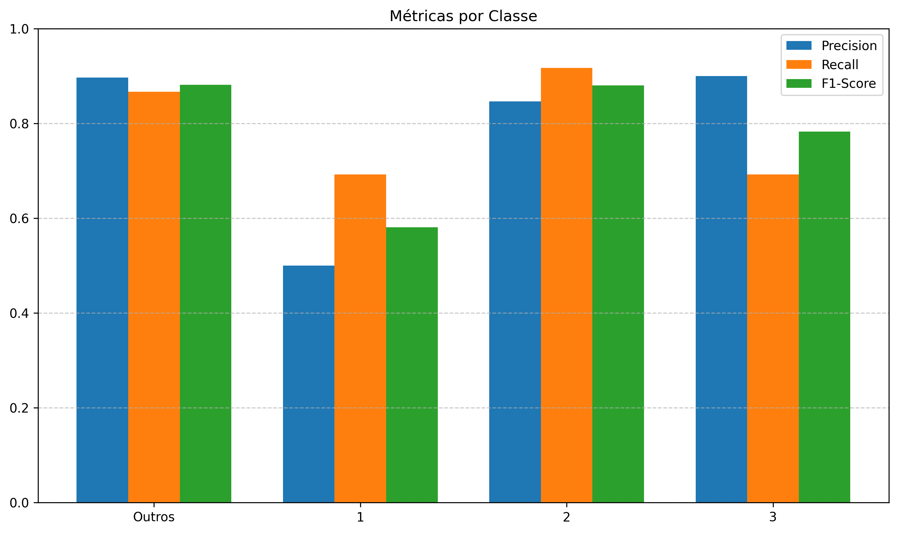

Na inferência:
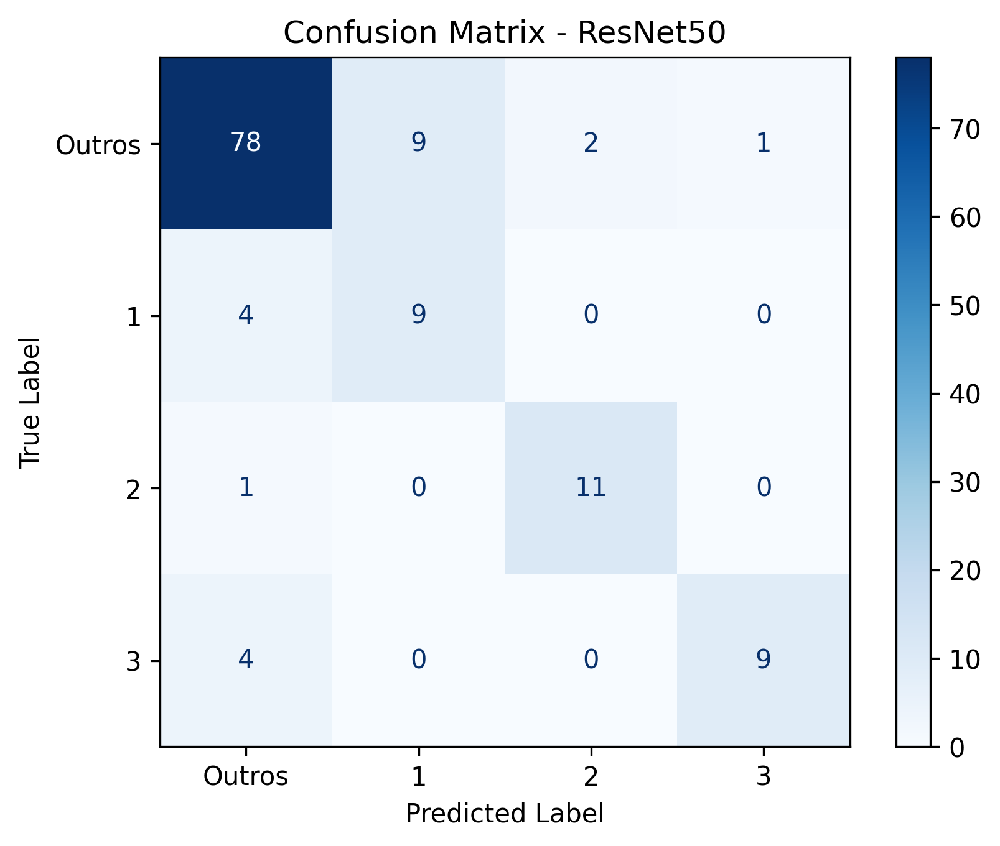

## Discussões prévias

- As principais dificuldades ocorreram devido ao desbalanceamento de classes e à limitação de dados.
- O uso de data augmentation e loss ponderado ajudou, mas o modelo ainda pode ser melhorado com mais dados reais das classes minoritárias.
- Em tarefas futuras, pode-se investigar ensemble de modelos.
- Na Parte 1, apesar do threshold fixo ter levado a melhor ele pode nao ser a melhor opção para tarefas automatizadas, portanto, a melhor opção (sem necessidade de ajuste manual no threshold) é o uso do Threshold de Otsu.